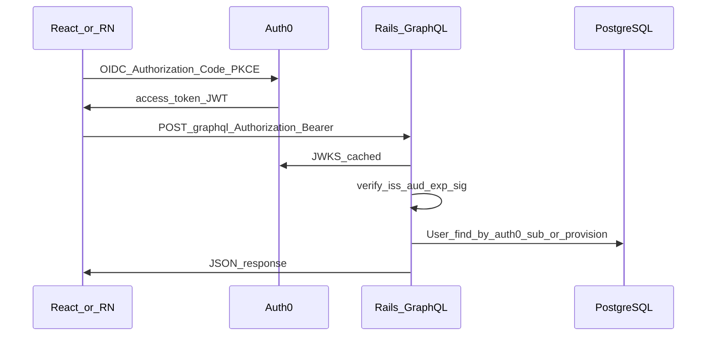

# Auth0 for GraphQL (replace Devise-JWT)

**Spec id:** `auth0-graphql-jwt`  
**Source:** Implementation plan (Cursor); copied in-repo before implementation.  
**Last updated:** 2026-04-18 (secrets steps added)

## Purpose

Replace **devise-jwt** with **Auth0**-issued access tokens for `/graphql`: Rails validates JWTs via JWKS, maps `sub` (and optional email linking) to `User`, and keeps **Devise cookie sessions** for the HTML admin UI. Supports future **React** (SPA) and **React Native** clients using Authorization Code + PKCE against Auth0.

## Implementation checklist

- [x] Document `AUTH0_DOMAIN` / `AUTH0_AUDIENCE` (Rails credentials + optional `ENV`, see below) and Auth0 dashboard: API (Resource Server), SPA + Native apps, callback URLs
- [x] Migration: add `auth0_sub` (nullable, unique); drop `jti` and index; update `User` model and test fixtures
- [x] Add JWKS-cached Auth0 access token verifier + wire `GraphqlController` (`current_user` from token, not Devise-JWT)
- [x] Remove `devise-jwt` gem, Devise JWT config, JSON JWT sign-in path in `Users::SessionsController`
- [x] Rewrite GraphQL integration tests (test-signed JWTs / JWKS stub; no live Auth0 in CI)

---

## Current behavior (what changes)

- `app/controllers/graphql_controller.rb`: Warden / devise-jwt — `user_signed_in?` after `Authorization: Bearer`.
- `app/models/user.rb`: `:jwt_authenticatable` and `JTIMatcher`; `db/schema.rb` `users.jti` exists for JWT revocation only.
- `app/controllers/users/sessions_controller.rb`: JSON sign-in path that issued JWTs (admin-only); `test/integration/graphql_create_user_test.rb` uses `POST /users/sign_in` and reads `Authorization` from the response.

GraphQL authorization (`app/graphql/concerns/graphql_pundit.rb`, `app/policies/user_policy.rb`) already uses `context[:current_user]` as a `User` record — unchanged; only **how** `current_user` is set for `/graphql` changes.

## Target architecture



**Split for this codebase**

- **GraphQL + React / React Native:** Auth0 access tokens (Bearer JWT), validated with Auth0 JWKS (`https://<domain>/.well-known/jwks.json`), issuer + audience checks.
- **Hotwire admin HTML:** Keep **Devise session** (cookies). No requirement to move browser login to Auth0 in this phase unless product asks for a single login everywhere.

## Auth0 dashboard (manual, one-time)

- Create a **Tenant** (fine for a global POC).
- Create an **API** (Resource Server): the **identifier** = `AUTH0_AUDIENCE` in Rails (must match token `aud`).
- Create **SPA** + **Native** applications; allow them to call that API; set **Allowed Callback URLs** / **Logout URLs** for dev and production.
- For POC, prefer **`users.role` in PostgreSQL** over mirroring admin in Auth0 unless you add Actions/Rules.

## Rails implementation

### Dependencies

- Add **`jwt`** with JWKS retrieval and caching (e.g. `Rails.cache` TTL).
- Remove **`devise-jwt`** from `Gemfile` once the new path works.
- **Not required** for this flow: `omniauth-auth0`, `omniauth-rails_csrf_protection` (only if Rails hosts server-side OAuth redirects, e.g. “Sign in with Auth0” via OmniAuth).

### Configuration

- Reader code should follow the same pattern already used for Devise JWT in `config/initializers/devise.rb`: **environment variables override encrypted credentials**, e.g. `ENV["AUTH0_DOMAIN"].presence || Rails.application.credentials.dig(:auth0, :domain)` (and similarly for `AUTH0_AUDIENCE` / `audience`).
- **Required keys:** `AUTH0_DOMAIN` (tenant host, e.g. `your-tenant.eu.auth0.com`) and `AUTH0_AUDIENCE` (Auth0 API **identifier** — a URL or logical id, not a client secret).

### Rails secrets (conventions)

1. **Encrypted credentials (primary store for non-Docker local dev)**  
   - Edit: `bin/rails credentials:edit` (set `EDITOR` if needed, e.g. `EDITOR="code --wait"`).  
   - Add a nested block (example shape — align names with initializer lookups):

     ```yaml
     auth0:
       domain: your-tenant.eu.auth0.com
       audience: https://your-api-identifier/
     ```

   - Commit **`config/credentials.yml.enc`** only — never commit the decrypted YAML or `master.key`.

2. **Master key**  
   - Local: `config/master.key` (listed in `.gitignore`) unlocks `credentials.yml.enc`, or set **`RAILS_MASTER_KEY`** in the environment if the key file is not present (CI, containers).  
   - Production/Compose/Kamal: inject **`RAILS_MASTER_KEY`** or mount the key file securely; same pattern as other Rails 8 deployments.

3. **Environment variables (override or sole source in production/Docker)**  
   - Set **`AUTH0_DOMAIN`** and **`AUTH0_AUDIENCE`** in the host/orchestrator env when you prefer not to bake credentials (mirrors `SIMARTE_RAILS_DATABASE_PASSWORD` style in `config/database.yml`).  
   - Optional: add **`AUTH0_ISSUER`** only if you need a non-default issuer string; otherwise derive issuer in code as `https://#{domain}/` (trailing slash must match Auth0 token `iss`).

4. **No secrets in the repo**  
   - Do not add real Auth0 values to `README`, committed `.env`, or tracked config files. Public **Client ID** for SPAs may live in client env (`VITE_*`, `EXPO_PUBLIC_*`) — distinguish from **server** validation settings above.

5. **Test environment**  
   - **Test** should not depend on live Auth0 or real `credentials` values for JWT verification; use stubbed JWKS / test keys (see Automated testing). If `test.rb` needs placeholders, use `Rails.application.credentials` only if you add test-specific keys, or stub constants in test helpers.

6. **Documentation touchpoints**  
   - Extend **[AGENTS.md](../../../AGENTS.md)** or deployment docs with “set `RAILS_MASTER_KEY` / Auth0 env vars in Compose” if operators need a single place to read; keep a **`.env.example`** in-repo with **empty or placeholder** `AUTH0_*` keys only if the project adopts dotenv-style examples.

### User model and DB

- Add nullable-unique `auth0_sub` to map Auth0 `sub` → `User`.
- **Linking strategy** (choose one):
  - **Preferred:** `sub` is canonical; backfill/link admins via script or one-time link.
  - **POC convenience:** first valid token: match **verified email** from claims to `users.email`, then persist `auth0_sub` (only if Auth0 email verification is trusted).
- Remove `:jwt_authenticatable`, `JTIMatcher`, and `config.jwt` from `config/initializers/devise.rb`.
- Migration: drop `jti` + index; update `test/fixtures/users.yml`.

### GraphQL controller

- Replace `require_jwt_authenticated_user!` + Devise `user_signed_in?` with: Bearer parse → verify (e.g. `Auth0AccessTokenVerifier`, `iss` = `https://<AUTH0_DOMAIN>/`, `aud` = `AUTH0_AUDIENCE`) → resolve `User` → `context[:current_user]`. Unauthenticated: same 401 JSON as today.

### JSON session endpoint

- Remove JSON-only paths that existed to issue Devise JWTs in `Users::SessionsController` (skip session / CSRF exceptions for that branch). **HTML** Devise sign-in stays.

## Automated testing

- Integration tests: **Bearer tokens** built in test with a **fixed RSA keypair** + **test JWKS** stub (WebMock or test-only verifier override). No Auth0 calls in CI.
- Keep coverage: 401 without token; authenticated admin GraphQL flows in `test/integration/graphql_create_user_test.rb`.

## Manual testing (Postman, Insomnia, curl, GraphiQL)

Goal: get an Auth0 **access token** with `aud` = API identifier, then `POST /graphql` with `Authorization: Bearer <token>`.

1. **Auth0:** Test user + token must target the **same API** (`AUTH0_AUDIENCE`). Link that identity to a Rails `User` (`auth0_sub` or email linking).

2. **Get token (example: Postman):** OAuth 2.0 → **Authorization Code (With PKCE)**.  
   - Auth URL: `https://<AUTH0_DOMAIN>/authorize`  
   - Token URL: `https://<AUTH0_DOMAIN>/oauth/token`  
   - Client ID: Auth0 SPA app  
   - Callback: e.g. `https://oauth.pstmn.io/v1/callback` (listed in Auth0 **Allowed Callback URLs**)  
   - **Audience:** API identifier  

3. **Request:** `POST /graphql`, `Content-Type: application/json`, body with `query` / `variables`, header `Authorization: Bearer <access_token>`.

4. **Avoid** **Client Credentials** for “act as a user” — machine tokens won’t match `User` unless explicitly supported.

5. **GraphiQL** (`/graphiql` in development): often no Bearer header unless customized; Postman is simpler for JWT smoke tests.

## Client apps (out of repo; E2E)

- **React:** Auth0 SPA SDK (or OIDC client) + PKCE; send `Authorization: Bearer <access_token>` to GraphQL.
- **React Native:** Auth0 RN SDK or Expo + `expo-auth-session` + PKCE; store refresh tokens in **Keychain / Keystore**.

## Risks and follow-ups

- **Admins** must exist in Auth0 or be linked before GraphQL accepts them.
- **`createUser` mutation** may still set Devise passwords for DB-backed users — OK for admin-provisioned accounts; revisit “invite via Auth0” later.
