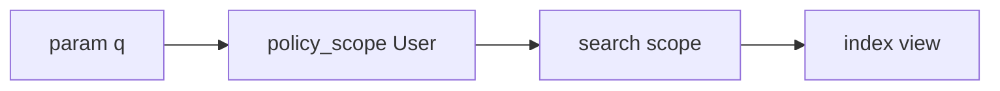

# User management search

**Spec id:** `user-management-search`  
**Source:** Implementation plan (Cursor); copied here to preserve decisions in-repo.  
**Last updated:** 2026-04-12

## Purpose

Make the **User management** search bar functional: filter users by a single query string `q`, keep authorization via `policy_scope(User)`, improve UX with **debounced** requests and **highlight** of matches.

## Decisions (locked)

| Topic | Decision |
|--------|----------|
| **Query contract** | **Option A:** single param **`q`** only (e.g. `GET /admin/users?q=jane`). No separate `name` / `role` / `service_id` params for v1. |
| **Authorization** | Apply **`policy_scope(User)`** first, then search scope, so non-admins still see nothing. |
| **Step 7 — Debounce** | Stimulus controller; debounce ~250–400ms; then **`requestSubmit()`** on GET form or **`Turbo.visit`**; form works without JS. |
| **Step 7 — Highlight** | Prefer **server-side** safe marking (e.g. `<mark>`) using **`@q`**, with proper escaping; client-side wrapping is optional fallback. |

## Implementation checklist

- [x] Query contract: single `q` (option A)
- [x] `User` search scope: ILIKE on name/email, role matching, joins + `distinct` for service name
- [x] `Admin::UsersController#index`: read `params[:q]`, apply scope, pass `@q` to view
- [x] View: GET form to `admin_users_path`, `text_field_tag :q`, preserve `params[:q]`
- [x] Update “Total Users” / “Showing …” for filtered count
- [x] Integration tests: admin `GET` with `q`, empty `q`, guest blocked
- [x] Stimulus: debounced search submit (`admin_user_search_controller`, 300ms)
- [x] Highlight: server-side `<mark>` via `ApplicationHelper#highlight_search` on name, email, role UI

---

## Current state (before implementation)

- `app/views/admin/users/index.html.erb`: search `<input>` has no `name`, no form, no JS.
- `Admin::UsersController#index`: loads all users; no filter params.

## Step 1 — Query contract (A)

- One param: `GET /admin/users?q=…`
- Server matches across: **email**, **first_name**, **last_name** (and/or full-name style), **role** labels, users with an **active subscription** to a **service** whose name matches `q` (joins + `distinct`).

## Step 2 — Backend

- PostgreSQL `ILIKE` with sanitized wildcards where needed.
- Scope e.g. `User.search(q)`; use `policy_scope(User).search(q)`.

## Step 3 — Controller

- Strip blank `q`.
- `@users = policy_scope(User).search(q).includes(...).order(:email)` (handle `distinct` / includes order to avoid duplicate rows).
- `@q` for re-display and highlighting.

## Step 4 — View

- `form_with url: admin_users_path, method: :get`, `text_field_tag :q, @q` (or `params[:q]`).
- Step 7 adds debounced `requestSubmit` / Turbo visit.

## Step 5 — Counts

- “Total Users” / “Showing X–Y of Z” reflect **filtered** `@users` (pagination later).

## Step 6 — Tests

- Signed-in admin: `GET admin_users_path(q: "…")` asserts filtered rows.
- Empty `q`: full list.
- Guest: existing admin auth rules.

## Step 7 — Debounce + highlight

### 7a Debounce

- Stimulus on form/input; debounce input events; then navigate with Turbo-friendly GET.
- Progressive enhancement: plain submit still works.

### 7b Highlight

- **Recommended:** pass `@q` into table row rendering; wrap case-insensitive substring matches in `<mark>` (or styled span) with Rails-safe escaping.
- Optional: client-side highlight via `data-query` + Stimulus after render (more fragile).

---

## Architecture (target)

---

## Summary

**(1–6)** Single **`q`**, **`policy_scope` + search**, **`#index`**, **GET form**, **counts**, **tests**.  
**(7)** **Debounced** Stimulus + **highlight** (prefer server-side safe marking).
